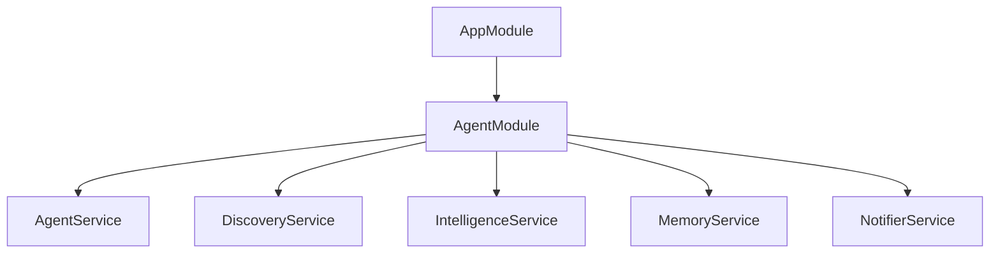

CareerAtlas is built around a linear agent loop in the NestJS backend: discover jobs, deduplicate them, score them against the user profile, and alert on high-value matches.[^1][^2][^3][^4][^5] The current implementation keeps side effects localized in dedicated services, which makes the control flow easy to reason about and change.[^6][^7][^8][^9][^10]

## System Flow

| Step | Service | Responsibility | Main Output |
| --- | --- | --- | --- |
| 1 | DiscoveryService | Launches Playwright, scrapes LinkedIn job cards, and produces `ScrapedJob[]`. | Candidate jobs |
| 2 | MemoryService | Hashes `title + company` and checks `seen_jobs.json`. | Seen / unseen decision |
| 3 | IntelligenceService | Loads `profile.txt` and scores the job with Groq + LangChain. | `JobScore` |
| 4 | NotifierService | Sends a Telegram Markdown alert when the match score is high enough. | Telegram notification |
| 5 | AgentService | Coordinates the end-to-end workflow and marks jobs as seen. | End-to-end run |

## Backend Module Map

## Important Implementation Details

- `AppModule` loads `.env` through `ConfigModule` and boots `AgentModule`.[^6]
- `AgentService` currently starts automatically on application bootstrap and runs one workflow for `software engineer` in `Remote` mode during testing.[^7]
- `DiscoveryService` uses a Chromium browser with a desktop user agent and limits extraction to the first 10 cards for safety.[^8]
- `IntelligenceService` uses `ChatGroq` with `llama-3.3-70b-versatile` and parses structured output into `JobScore` fields.[^9]
- `MemoryService` persists dedupe state as a flat JSON array of SHA-256 strings in `seen_jobs.json`.[^10]
- `NotifierService` sends Markdown messages to Telegram using native `fetch` and skips alerts when credentials are missing.[^11]

## Frontend State

The frontend is present as a separate Next.js app but currently uses the default starter page, layout metadata, and base CSS, so it has not yet become part of the main runtime workflow.[^12][^13][^14]

[^1]: ai-context/AGENTS.md
[^2]: ai-context/ARCHITECTURE.md
[^3]: ai-context/PROGRESS.md
[^4]: backend/src/agent/agent.service.ts
[^5]: backend/src/app.module.ts
[^6]: backend/src/main.ts
[^7]: backend/src/agent/agent.service.ts
[^8]: backend/src/discovery/discovery.service.ts
[^9]: backend/src/intelligence/intelligence.service.ts
[^10]: backend/src/memory/memory.service.ts
[^11]: backend/src/notifier/notifier.service.ts
[^12]: frontend/app/page.tsx
[^13]: frontend/app/layout.tsx
[^14]: frontend/app/globals.css