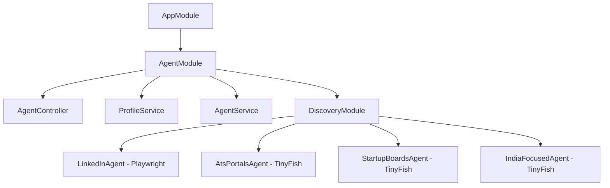

CareerAtlas is built around a linear agent loop in the NestJS backend: discover jobs, deduplicate them, score them against the user profile, and alert on high-value matches.[^1][^2][^3][^4][^5] The current implementation keeps side effects localized in dedicated services, which makes the control flow easy to reason about and change.[^6][^7][^8][^9][^10]

## System Flow

| Step | Service | Responsibility | Main Output |
| --- | --- | --- | --- |
| 1 | ProfileService | Parses uploaded resume PDF to JSON (`profile.json`) using LLM, and suggests job title search terms. | `profile.json` & Suggested Titles |
| 2 | AgentController | Receives user-confirmed/edited search terms and triggers the scraper run in the background. | Job search query trigger |
| 3 | Discovery Agents | Parallel scrapers: Playwright (`LinkedInAgent`) and TinyFish Search API (`AtsPortalsAgent`, `StartupBoardsAgent`, `IndiaFocusedAgent`). | Real-time candidate jobs |
| 4 | MemoryService | Hashes `company + title + location + source` and checks `seen_jobs.json` to prevent duplicates. | Seen / unseen decision |
| 5 | IntelligenceService | Evaluates candidate jobs against the parsed JSON profile using Groq + LangChain. | `JobScore` & extracted metadata |
| 6 | NotifierService | Sends a Telegram Markdown alert when the match score is high enough. | Telegram notification |
| 7 | AgentService | Coordinates the background loop, applies LLM location/company refinements, and gathers 5 matches. | Completed run |

## Backend Module Map

## Important Implementation Details

- `AppModule` loads `.env` through `ConfigModule` and boots `AgentModule`.[^6]
- `ProfileService` extracts raw text from PDF resume uploads using `pdf-parse` and structures it into a comprehensive profile JSON (`profile.json`) containing contact, skills, experience, projects, and education using Llama 3.3.
- `AgentController` provides the interactive REST API endpoints for uploading resumes, getting profile info, generating recommended search titles, and triggering runs.
- `AgentService` remains in standby mode upon bootstrapping and is invoked asynchronously when the user confirms search titles via the API.
- `LinkedInAgent` uses Chromium with custom scripts (blocking WebGL/Canvas fingerprinting, masking webdriver) and human-like typing to scrape jobs securely.[^8]
- `AtsPortalsAgent`, `StartupBoardsAgent`, and `IndiaFocusedAgent` query the **TinyFish Search API** directly, bypassing expired caches and avoiding Playwright execution overhead.
- `IntelligenceService` uses a multi-provider fallback configuration (Gemini API, Groq with `llama-3.3-70b-versatile`, or local Ollama) and parses structured output into `JobScore` fields, refining company names and physical locations from titles and snippets.[^9]
- `MemoryService` persists dedupe state as a flat JSON array of SHA-256 strings in `seen_jobs.json` using a compound key (`company|title|location|source`).[^10]
- `NotifierService` sends Markdown messages to Telegram using native `fetch` and skips alerts when credentials are missing.[^11]

## Frontend State

The frontend is present as a separate Next.js app but currently uses the default starter page, layout metadata, and base CSS, so it has not yet become part of the main runtime workflow.[^12][^13][^14]

[^1]: ai-context/AGENTS.md
[^2]: ai-context/ARCHITECTURE.md
[^3]: ai-context/PROGRESS.md
[^4]: backend/src/agent/agent.service.ts
[^5]: backend/src/app.module.ts
[^6]: backend/src/main.ts
[^7]: backend/src/agent/agent.service.ts
[^8]: backend/src/discovery/discovery.service.ts
[^9]: backend/src/intelligence/intelligence.service.ts
[^10]: backend/src/memory/memory.service.ts
[^11]: backend/src/notifier/notifier.service.ts
[^12]: frontend/app/page.tsx
[^13]: frontend/app/layout.tsx
[^14]: frontend/app/globals.css