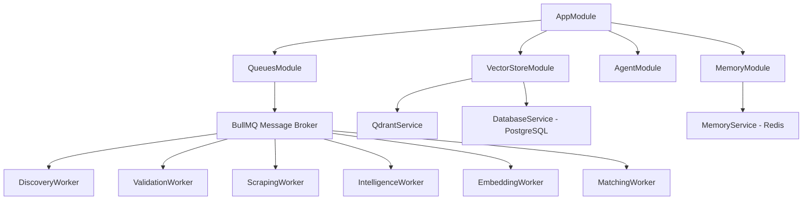

CareerAtlas is built as a distributed, queue-driven NestJS application designed to scale horizontally across workers. The system coordinates long-running scraping, LLM-based parsing, vector indexing, and skills-overlap matching through specialized message queues.

## System Workflow Pipeline

The processing pipeline is organized into five concurrent stages coordinated via **BullMQ**:

| Step | Worker / Service | Responsibility | State Management & Cache |
| --- | --- | --- | --- |
| **1** | **ProfileService** | Parses PDF resume to structured profile JSON (`profile.json`) using LLM and suggests search terms. | Local File / Database |
| **2** | **DiscoveryWorker** | Run parallel queries across ATS platforms (Greenhouse, Lever, Ashby, Workable), Startup boards (YC, Wellfound), and LinkedIn. | Enqueues raw jobs to Redis |
| **3** | **ValidationWorker** | Verifies URL status, checks database and Qdrant duplicates, and scans live page status (checking for 404s, empty pages, and closed keywords). | Redis Hash & Sets (24h TTL) |
| **4** | **ScrapingWorker** | Spawns anti-detect browser contexts (`CamoufoxScraperService`) to extract raw job descriptions. | Shared browser pooling |
| **5** | **IntelligenceWorker** | Extracts structured candidate requirements (experience, remote status, skills list) via LLM. | Tri-level LLM fallback chain |
| **6** | **EmbeddingWorker** | Generates text embeddings using `fastembed` in-process (`BGE-Small-EN-v1.5`) and upserts vector payloads. | Qdrant Vector DB |
| **7** | **MatchingWorker** | Ranks jobs using a constant-time $O(1)$ flat `SKILL_INDEX` taxonomy, generates match rationales, and alerts. | PostgreSQL results & Telegram |

## Backend Module Map

## Important Implementation Details

### 1. Redis Caching & State Coordination
- **Deduplication**: `MemoryService` hashes job details (`company|title|location|source`) using SHA-256 and stores them in Redis sets (`careeratlas:processed_jobs` and `careeratlas:matched_jobs`) with a 24-hour expiration TTL. This prevents disk-locking and memory leaks.
- **Pipeline Tracking**: `PipelineCoordinatorService` tracks active run states, execution logs, and remaining job counters in Redis. Job decrements are handled via atomic `INCR` commands to ensure thread safety across parallel BullMQ queue threads.

### 2. Validation & Expiry Rules
- **Early Bypass**: Jobs already indexed in Qdrant bypass downstream scraping and LLM parsing entirely.
- **Expiry Checking**: Evaluates if a job is closed or inactive. It checks if the URL returns a 404 error, if the page text is empty/missing, or if the full text contains expired keywords (e.g. `hiring has ended`, `role is closed`).
- **Dynamic Imports**: To prevent CommonJS runtime packaging failures, `@tiny-fish/sdk` is loaded dynamically within `ValidationService` during the NestJS `OnModuleInit` hook.

### 3. In-Process Embedding Generation
- Replaced Python-based dependencies and event-loop-blocking ONNX models with Qdrant `fastembed` (`EmbeddingModel.BGESmallENV15`). Models are downloaded locally and run directly in the Node.js process using native hardware acceleration.

### 4. Browser Context Pooling
- `CamoufoxScraperService` maintains a single running browser instance (`camoufox`). For each scrape task, it creates an isolated browser context (`newContext()`) and tab (`newPage()`), disposing of them immediately afterward. This yields a 10x reduction in memory/CPU overhead while preventing cookie tracking.

## Frontend State

The frontend is a React Next.js application that streams active pipeline logs, coordinates resume parsing, and displays matching results from the backend in real-time.