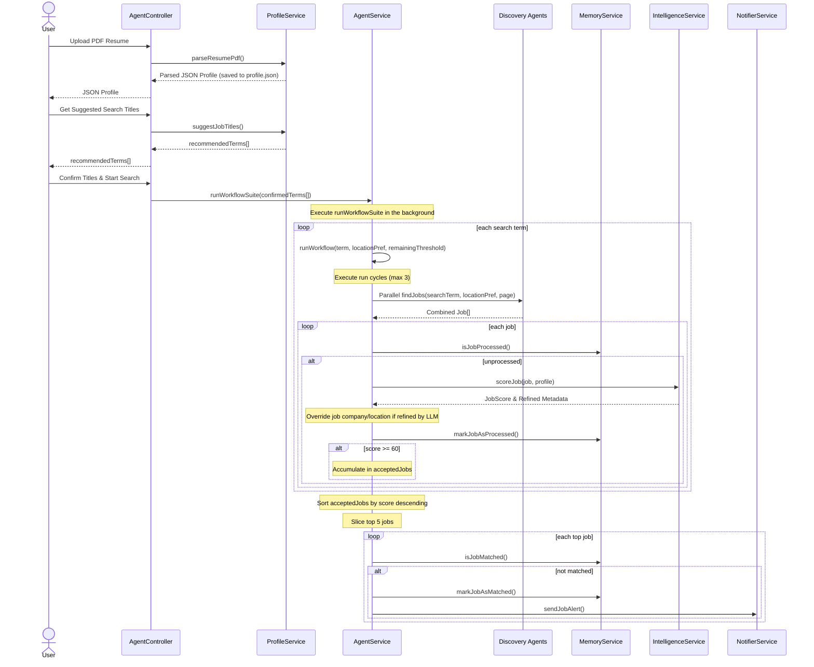

The CareerAtlas backend is decomposed into a focused set of NestJS services. Each service owns one part of the pipeline so the agent loop stays readable and easy to change.[^1][^2][^3][^4][^5]

## Service Responsibilities

| Service / Agent | Responsibility | Key Methods / Behavior |
| --- | --- | --- |
| AgentController | Exposes endpoints for resume upload, suggestions, and running the agent. | `uploadResume()`, `getProfile()`, `suggestTitles()`, `runAgent()` |
| ProfileService | Parses PDF resume using LLM, saves it to `profile.json`, and recommends search titles. | `parseResumePdf()`, `getProfile()`, `suggestJobTitles()` |
| AgentService | Orchestrates the workflow loop, extracts location, overrides refined metadata, and filters results. | `onApplicationBootstrap()`, `runWorkflow()` |
| LinkedInAgent | Scrapes LinkedIn directly with Playwright Chromium under fingerprint masking. | `findJobs(searchTerm, locationPref, page)` |
| AtsPortalsAgent | Queries TinyFish Search API for Greenhouse/Lever/Ashby/Workable links. | `findJobs(searchTerm, locationPref, page)` |
| StartupBoardsAgent | Queries TinyFish Search API for YC/Wellfound job boards (with catalog filters). | `findJobs(searchTerm, locationPref, page)` |
| IndiaFocusedAgent | Queries TinyFish Search API for Instahyre/Cutshort/Naukri (with precise path queries). | `findJobs(searchTerm, locationPref, page)` |
| IntelligenceService | Scores scraped jobs and verifies physical locations/company names using Groq Llama 3.3. | `scoreJob()` |
| MemoryService | Creates and checks SHA-256 job fingerprints (matched & processed). | `isJobMatched()`, `isJobProcessed()`, `markJobAsMatched()`, `markJobAsProcessed()`, `generateJobHash()` |
| NotifierService | Sends Telegram alerts for strong matches. | `sendJobAlert()` |
| AppModule | Wires configuration and the main agent module. | `ConfigModule.forRoot()`, `AgentModule` |

## Dependency Flow

## What Each Module Depends On

- `AgentController` depends on `ProfileService` and `AgentService`.
- `ProfileService` depends on `pdf-parse`, `profile.json`, and the Groq/Gemini/Ollama LLM model.
- `AgentService` depends on all four discovery agents plus intelligence, memory, notification, and profile services.[^1]
- `LinkedInAgent` depends on Playwright Chromium browser contexts, user-agent/locale settings, and local cookie authentication.[^2]
- `AtsPortalsAgent`, `StartupBoardsAgent`, and `IndiaFocusedAgent` depend on the **TinyFish Search API** and your `TINYFISH_API_KEY` credential.
- `IntelligenceService` depends on Groq/Gemini/Ollama API credentials and LangChain structured parsing.[^3]
- `MemoryService` depends on the local filesystem and SHA-256 hashing to track `seen_jobs.json` and `processed_jobs.json`.[^4]
- `NotifierService` depends on Telegram credentials and the global `fetch` API.[^5]

## Operational Notes

- Jobs are marked as processed when evaluated, and marked as matched when successfully notified, preventing duplicate LLM calls or duplicate notifications.[^1]
- The search query is constrained to a **7-day date window** across all search engine queries to guarantee result recency.
- The scorer enforces **strict experience checks** to automatically filter out senior/mid-senior roles when evaluating junior candidate profiles.
- The project rules say the dedupe file must remain a flat array of strings, so any future change to `seen_jobs.json` must preserve that shape.[^6]

[^1]: backend/src/agent/agent.service.ts
[^2]: backend/src/discovery/discovery.service.ts
[^3]: backend/src/intelligence/intelligence.service.ts
[^4]: backend/src/memory/memory.service.ts
[^5]: backend/src/notifier/notifier.service.ts
[^6]: ai-context/RULES.md