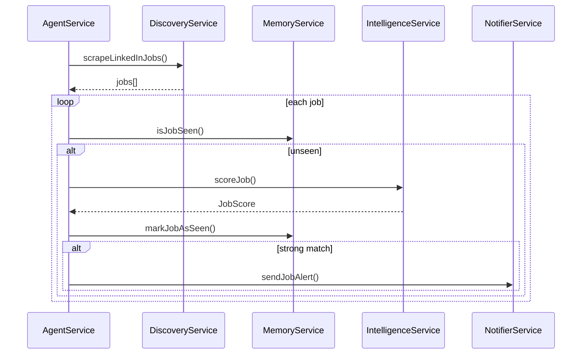

The CareerAtlas backend is decomposed into a focused set of NestJS services. Each service owns one part of the pipeline so the agent loop stays readable and easy to change.[^1][^2][^3][^4][^5]

## Service Responsibilities

| Service | Responsibility | Key Methods / Behavior |
| --- | --- | --- |
| AgentService | Orchestrates the full workflow. | `onApplicationBootstrap()`, `runWorkflow()` |
| DiscoveryService | Scrapes job listings with Playwright. | `scrapeLinkedInJobs()` |
| IntelligenceService | Loads the user profile and scores jobs using Groq. | `scoreJob()` |
| MemoryService | Creates and checks SHA-256 job fingerprints. | `isJobSeen()`, `markJobAsSeen()`, `generateJobHash()` |
| NotifierService | Sends Telegram alerts for strong matches. | `sendJobAlert()` |
| AppModule | Wires configuration and the main agent module. | `ConfigModule.forRoot()`, `AgentModule` |

## Dependency Flow

## What Each Module Depends On

- `AgentService` depends on all worker services plus notifications.[^1]
- `DiscoveryService` depends on Playwright and the LinkedIn public jobs DOM.[^2]
- `IntelligenceService` depends on `profile.txt`, Groq API credentials, and LangChain structured parsing.[^3]
- `MemoryService` depends only on the local filesystem and SHA-256 hashing.[^4]
- `NotifierService` depends on Telegram credentials and the global `fetch` API.[^5]

## Operational Notes

- Jobs are marked as seen both when they are skipped and when they trigger an alert, which prevents repeated processing.[^1]
- The current skip threshold in the source is below 60, so only jobs at 60 or above should notify.[^1]
- The project rules say the dedupe file must remain a flat array of strings, so any future change to `seen_jobs.json` must preserve that shape.[^6]

[^1]: backend/src/agent/agent.service.ts
[^2]: backend/src/discovery/discovery.service.ts
[^3]: backend/src/intelligence/intelligence.service.ts
[^4]: backend/src/memory/memory.service.ts
[^5]: backend/src/notifier/notifier.service.ts
[^6]: ai-context/RULES.md