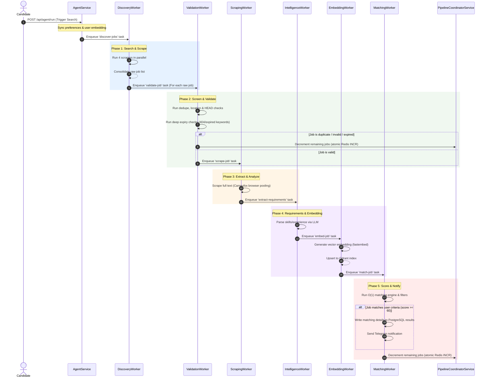

The CareerAtlas backend is built as a highly decoupled, queue-driven NestJS architecture using **BullMQ**, **Redis**, **PostgreSQL**, and **Qdrant** to orchestrate job discovery, validation, scraping, analysis, embedding, and matching.

## Service Responsibilities

| Service / Agent / Worker | Responsibility | Key Methods / Behavior |
| --- | --- | --- |
| **AgentController** | Exposes endpoints for resume upload, suggestions, and running the agent. | `uploadResume()`, `getProfile()`, `suggestTitles()`, `runAgent()` |
| **ProfileService** | Parses PDF resume using LLM, saves it to `profile.json`, and recommends search titles. | `parseResumePdf()`, `getProfile()`, `suggestJobTitles()` |
| **AgentService** | Syncs user preferences and triggers the BullMQ discovery runs. | `runAgent()`, `runWorkflowSuite()` |
| **PipelineCoordinatorService** | Synchronizes steps, logs, and job counters in Redis to manage run states across distributed workers. | `startRun()`, `updateStep()`, `addLog()`, `decrementRemainingJobs()` |
| **DiscoveryWorker** | Parallelizes queries across discovery agents and enqueues raw jobs for validation. | `atsPortalsAgent`, `startupBoardsAgent`, `indiaFocusedAgent`, `linkedinAgent` |
| **ValidationService** | Performs duplicate checks, location validation, and deep async expiry checks (detecting 404s, empty pages, and closed keywords via dynamic TinyFish imports). *Note: Testing scripts have been purposefully excluded.* | `validateSingleJob()`, `isExpired()`, `isUrlActive()`, `isJobInUserResults()` |
| **ValidationWorker** | Pulls from the `job-validation` queue, executes `ValidationService` checks, and forwards valid jobs. | `process()` |
| **ScrapingWorker** | Uses anti-detect scrapers to extract full job descriptions and enqueues requirements extraction. | `process()` |
| **CamoufoxScraperService** | anti-detect browser scraper implementing browser session pooling and context isolation for minimal CPU overhead. | `scrapeUrl()`, `getBrowser()`, `onModuleDestroy()` |
| **IntelligenceWorker** | Pulls from `job-intelligence` and invokes requirements extraction. | `process()` |
| **JobIntelligenceService** | Extracts critical, required, and preferred skills, location, remote status, and experience level using LLM provider chains. | `extractRequirements()` |
| **EmbeddingWorker** | Generates embeddings in-process and writes vector payloads. | `process()` |
| **EmbeddingsService** | Generates high-efficiency embeddings locally using Qdrant `fastembed` (`BGE-Small-EN-v1.5`), ensuring all cache writes are awaited. | `generateEmbedding()`, `onModuleInit()` |
| **MatchingWorker** | Pulls from `job-matching`, checks requirements, rates matches, and triggers notifications. | `process()` |
| **MatchingService** | Scores candidate jobs using a flattened $O(1)$ constant-time `SKILL_INDEX` taxonomy, generates personal LLM match rationales, and alerts. | `matchAndRankJobs()`, `scoreJob()` |
| **MemoryService** | Deduplicates jobs using SHA-256 hashes stored in Redis sets with 24-hour expiration TTLs. | `isJobMatched()`, `isJobProcessed()`, `markJobAsMatched()`, `markJobAsProcessed()`, `generateJobHash()` |
| **NotifierService** | Sends Telegram alerts for high-value job matches. | `sendJobAlert()` |

## Pipeline Dependency Flow

The system uses BullMQ queues to coordinate asynchronous tasks across isolated workers, synchronized via Redis and the `PipelineCoordinatorService`:

## What Each Module Depends On

- **`MemoryService` & `PipelineCoordinatorService`** depend on **Redis** (`ioredis` client) for lightning-fast, atomic deduplication and pipeline state tracking.
- **`EmbeddingsService`** depends on **Qdrant `fastembed`** (`@xenova/transformers` was replaced) to perform in-process, high-efficiency local embedding generation.
- **`ValidationService`** depends on `@tiny-fish/sdk` (loaded dynamically via dynamic `import()` to bypass CommonJS packaging restrictions at runtime) to fetch and inspect job postings for 404 errors, empty content, or closed keywords.
- **`CamoufoxScraperService`** depends on Playwright Firefox (`camoufox`) and implements browser session pooling (`isConnected()` checks) and page context recycling to eliminate CPU-heavy browser initialization overhead.
- **`JobIntelligenceService`** depends on Groq, Gemini, or local Ollama LLMs to parse and structure unstructured job descriptions into typed JSON schemas.
- **`NotifierService`** depends on the Telegram Bot API.

## Operational Notes

- **Cache TTLs**: Deduplication hashes in Redis expire after 24 hours to ensure stale job metadata is cleaned up.
- **Atomic Concurrency**: Job progress counts are decremented using Redis `INCR` operations rather than read-modify-write calls, protecting against race conditions during highly parallel workers.
- **Lever Title Logic**: Job titles scraped from `lever.co` are automatically parsed to separate `company` and `title` fields, preventing downstream taxonomy categorization failures.
- **Unit Testing**: To prevent code clutter, active unit testing scripts for validation are purposefully excluded from the active workspace repository.