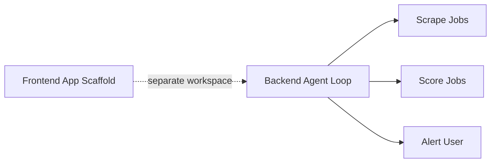

The CareerAtlas frontend is currently a starter Next.js app rather than a finished product UI. Its source tree is limited to the default app shell files, so the wiki should treat this area as scaffolding until a real CareerAtlas interface is introduced.[^1][^2][^3]

## Source Map

| File | What It Does | Current State |
| --- | --- | --- |
| `frontend/app/page.tsx` | Root page component. | Default create-next-app landing page with starter links and copy.[^1] |
| `frontend/app/layout.tsx` | Root layout and metadata. | Uses Geist fonts and starter metadata titled `Create Next App`.[^2] |
| `frontend/app/globals.css` | Global styles and theme tokens. | Minimal Tailwind v4 starter variables with a basic system font fallback.[^3] |
| `frontend/public/favicon.ico` | Browser tab icon. | Present in the app directory tree but not otherwise documented in the source pages. |

## What The Web App Currently Says

- The page content still tells the developer to edit `page.tsx` to get started.[^1]
- The layout metadata still identifies the app as a generic starter project rather than CareerAtlas.[^2]
- The global stylesheet is still the standard starter baseline, so there is no branded design system yet.[^3]

## Relationship To The Backend

## Practical Implication

The frontend wiki should be updated only when the app stops being a starter shell, when new route files are added, or when the project gains a real user-facing dashboard or settings flow.

[^1]: frontend/app/page.tsx
[^2]: frontend/app/layout.tsx
[^3]: frontend/app/globals.css