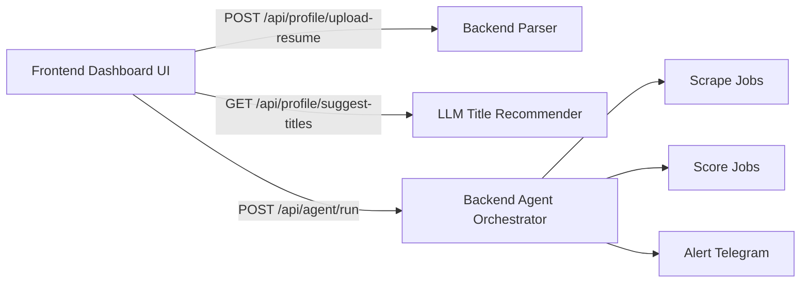

The CareerAtlas frontend is an interactive Next.js dashboard built using Tailwind CSS v4. It allows users to upload a PDF resume, trigger LLM-driven parsing and title recommendations, edit or add job search terms manually, and start the parallel discovery agents loop.

## Source Map

| File | What It Does | Current State |
| --- | --- | --- |
| `frontend/app/page.tsx` | Main interactive control dashboard. | Custom React component with PDF file upload, title editing tags, location input, and run status console.[^1] |
| `frontend/app/layout.tsx` | Root layout and metadata. | Configures customized title tags ("CareerOS - Autonomous Job Ingestion & Search").[^2] |
| `frontend/app/globals.css` | Global styles and theme tokens. | Includes Tailwind v4 base styles.[^3] |
| `frontend/next.config.ts` | Next.js configuration. | Defines API rewrite proxy rules routing `/api/:path*` traffic to the NestJS backend at `http://localhost:3000` to prevent CORS issues. |

## What The Web App Currently Says

- The page content provides a three-step configuration wizard (Upload Resume -> Setup Search Titles -> Launch Agents) with a live activity log.[^1]
- The layout metadata is custom-branded to CareerOS instead of the default starter metadata.[^2]

## Relationship To The Backend

## Practical Implication

The frontend dashboard serves as the user-facing control center of the MVP, allowing seamless pipeline orchestration without needing manual edits to local text configuration files.

[^1]: frontend/app/page.tsx
[^2]: frontend/app/layout.tsx
[^3]: frontend/app/globals.css