# CareerAtlas AI Job Search & Recommendation Platform Flowchart

This document details the complete end-to-end flowchart of the CareerAtlas Autonomous Job Search & Ingestion Platform. It maps the user onboarding flow, search preference setup, background ingestion loop (concurrency and scrapers), validation checks, LLM structured extraction, pgvector vector store insertion, multi-stage matching/ranking engine, and Telegram notification alerts.

## Mermaid Workflow Source

```mermaid
flowchart LR
  %% Subgraphs for layers
  subgraph Frontend ["Frontend - Next.js Web App"]
    direction TB
    F_Upload["1. Upload Resume PDF"]
    F_Params["6. Configure Search Parameters"]
    F_Trigger["7. Trigger Job Search"]
    F_Status["9. Poll Status & Logs"]
  end

  subgraph Backend ["Backend - NestJS API Service"]
    direction TB
    B_ProfileController["Profile Controller"]
    B_ProfileService["Profile Service (LLM Parser)"]
    B_AgentController["Agent Controller"]
    B_AgentService["Orchestrator Agent Loop"]
    B_DiscoveryAgent["Discovery Scrapers Network"]
    B_ValidationService["Validation Service"]
    B_IntelligenceService["Job Intelligence (LLM)"]
    B_EmbeddingsService["Embeddings Service"]
    B_MatchingService["Matching & Ranking Engine"]
    B_NotifierService["Notifier Service"]
  end

  subgraph Database ["Database Layer (PostgreSQL)"]
    direction TB
    DB_Profile[("user_preferences & user_skills")]
    DB_Embeddings[("job_embeddings & user_embeddings")]
    DB_Jobs[("jobs & job_requirements")]
  end

  subgraph LocalCache ["Local Cache"]
    MC_MemoryService["Memory Service (seen_jobs.json)"]
  end

  subgraph External ["External APIs & Integrations"]
    direction TB
    EXT_Groq["Groq LLM (Llama 3.3)"]
    EXT_TinyFish["TinyFish Search API"]
    EXT_LinkedIn["LinkedIn Web Scraper"]
    EXT_Telegram["Telegram Bot API"]
  end

  %% Relations / Edges
  F_Upload -->|2. Upload Resume| B_ProfileController
  B_ProfileController -->|3. Forward PDF text| B_ProfileService
  B_ProfileService -->|4. Parse resume structured text| EXT_Groq
  B_ProfileService -->|5. Save parsed profile| DB_Profile
  B_ProfileService -->|6. Return profile & recommendations| F_Params

  F_Trigger -->|7. POST /api/agent/run| B_AgentController
  B_AgentController -.->|8. Start background execution| B_AgentService
  B_AgentController -->|8. HTTP 202 Accepted| F_Status

  F_Status -->|9. Poll status & logs| B_AgentController
  
  B_AgentService -->|10. Sync runtime preferences| DB_Profile
  B_AgentService -->|11. Ingest concurrently| B_DiscoveryAgent
  
  B_DiscoveryAgent -->|12. Fetch live listings| EXT_TinyFish
  B_DiscoveryAgent -->|12. Headless browser crawl| EXT_LinkedIn
  B_DiscoveryAgent -.->|13. Return raw jobs| B_AgentService

  B_AgentService -->|14. Send to validation layer| B_ValidationService
  B_ValidationService -->|15. Check local memory| MC_MemoryService
  B_ValidationService -->|15. Check PostgreSQL duplicates| DB_Jobs

  B_ValidationService -.->|16. Forward validated jobs| B_IntelligenceService
  B_IntelligenceService -->|17. Parse JD requirements| EXT_Groq
  B_IntelligenceService -->|17. Generate vector embeddings| B_EmbeddingsService
  B_IntelligenceService -->|18. Save job details & requirements| DB_Jobs
  B_IntelligenceService -->|18. Store vector embeddings| DB_Embeddings

  B_AgentService -->|19. Run multi-stage match engine| B_MatchingService
  B_MatchingService -->|20. Calculate pgvector Cosine similarity| DB_Embeddings
  B_MatchingService -->|20. Match skills & experience| DB_Profile
  B_MatchingService -.->|21. Return qualifying ranked matches| B_AgentService

  B_AgentService -->|22. Trigger notification alert| B_NotifierService
  B_NotifierService -.->|23. Dispatch Telegram alert| EXT_Telegram
  EXT_Telegram -.->|24. Notify User| F_Upload

  %% Node Styling Classes
  classDef primary fill:#2563EB,stroke:#1D4ED8,color:#FFF;
  classDef success fill:#16A34A,stroke:#15803D,color:#FFF;
  classDef warning fill:#D97706,stroke:#B45309,color:#FFF;
  classDef error fill:#DC2626,stroke:#B91C1C,color:#FFF;
  classDef ai fill:#7C3AED,stroke:#6D28D9,color:#FFF;
  classDef infra fill:#6B7280,stroke:#4B5563,color:#FFF;

  %% Class Assignments
  class F_Upload,F_Params,F_Trigger,F_Status primary;
  class B_ProfileController,B_AgentController,B_AgentService,B_DiscoveryAgent,B_ValidationService,B_NotifierService,B_EmbeddingsService primary;
  class B_ProfileService,B_IntelligenceService,B_MatchingService,EXT_Groq ai;
  class DB_Profile,DB_Embeddings,DB_Jobs,MC_MemoryService,EXT_TinyFish,EXT_LinkedIn,EXT_Telegram infra;
```

---

## Documentation Companion

### 1. Objective
The CareerAtlas Ingestion & Search Platform is an autonomous, AI-driven job-hunting system. It streamlines the career exploration loop: parsing resume PDFs into structured user profiles, automatically recommending job titles, fetching matching job postings across multiple scraper sources (TinyFish and Playwright LinkedIn Guest scrapers) in parallel, validating link integrity and location parameters, storing listings in a vector database, performing cosine similarity ranking, and notifying candidates with customized match reasoning via Telegram.

### 2. Actors
*   **Candidate (Job Hunter):** The primary user who uploads their PDF resume, configures search preferences (target locations, remote choice, salary expectation, employment types, search titles), triggers the autonomous pipeline, and receives real-time Telegram job alerts.
*   **NestJS Orchestrator (Backend):** The core application engine. Coordinates scraper executions, handles resume parsing requests, executes hard filter/ranking algorithms, and connects to databases and caches.
*   **External Services:**
    *   **TinyFish Search API:** Discovers live, active jobs across Lever, Greenhouse, Ashby, YC, Wellfound, Cutshort, Instahyre, and Naukri.
    *   **LinkedIn Web Scraper:** Headless chromium browser (Playwright) that harvests real-time LinkedIn guest mode job postings using advanced anti-bot finger-print evasion tactics.
    *   **Groq API (Llama 3.3):** Serves as the primary LLM engine for structuring candidate resumes, extracting specific requirements from job descriptions, and formulating personalized match justifications.
    *   **Telegram Bot API:** Dispatches final formatted job match alerts to the user's custom Telegram chat/channel.

### 3. Step-by-Step Flow

#### A. User Onboarding & Resume Ingestion
1.  **Resume Upload:** The Candidate selects a PDF resume on the Next.js Frontend and initiates parsing.
2.  **Text Ingestion:** `ProfileController` receives the file, extracts the raw text via `pdf-parse`, and forwards it to `ProfileService`.
3.  **LLM Structuring:** `ProfileService` calls the Groq API (fallback to Gemini/Ollama) to extract structured JSON profile details (full name, email, phone, target role, core skills, experience level, recent experience, and projects).
4.  **Database Persistence:** The parsed profile is mapped and stored in PostgreSQL (`users`, `user_skills`, and `user_preferences` tables), and user embeddings are generated for vector search.
5.  **Title Recommender:** The LLM scans the candidate's skills and suggests relevant target job search titles, returning them to the Frontend.

#### B. Search Parameters & Ingestion Launch
6.  **Configuration:** The candidate confirms or edits the search titles and preferences (such as location target, remote openness, employment type, and salary target).
7.  **Execution Trigger:** The candidate clicks "Start Autonomous Job Search". The Next.js frontend sends a POST request containing preferences to the `/api/agent/run` endpoint.
8.  **Background Handoff:** `AgentController` triggers the orchestrator suite (`AgentService.runWorkflowSuite`) asynchronously in the background and returns a `202 Accepted` status code.
9.  **Real-Time Progress Polling:** The Next.js frontend starts polling the `/api/agent/status` endpoint every 1 second to update the visual timeline and activity console.

#### C. Scraping & Discovery Ingestion
10. **Runtime Sync:** The `AgentService` saves the runtime parameters to PostgreSQL `user_preferences`.
11. **Parallel Gathering:** The orchestrator fires 4 scraper threads in parallel:
    *   `LinkedInAgent` launches Playwright chromium browser to scrape guest mode job details.
    *   `AtsPortalsAgent` queries the TinyFish Search API for Greenhouse, Lever, and Ashby postings.
    *   `StartupBoardsAgent` queries the TinyFish Search API for YC and Wellfound listings.
    *   `IndiaFocusedAgent` queries the TinyFish Search API for Instahyre, Cutshort, and Naukri pages.
12. **Raw Job Consolidation:** Scraped job details are gathered and consolidated into a unified raw array.

#### D. Validation & Screening
13. **Data Verification:** Raw jobs are routed through `ValidationService` to filter garbage data before committing resource-intensive LLM queries:
    *   **Deduplication:** Filters out jobs already processed by comparing compound hash keys (`company|title|location|source`) against `seen_jobs.json` cache and executing database lookup.
    *   **Expiry Check:** Scans the description snippet for "role closed" or "no longer accepting applications" terms.
    *   **URL HEAD-Ping:** Executes an asynchronous HTTP `HEAD` (or `GET` fallback) request with a strict 2.5-second timeout to verify the application page is live.
    *   **Relevance Check:** Filters out jobs matching negative keywords (sales, HR, marketing) or mismatching geographical preferences.

#### E. Job Intelligence & Vector Store Ingestion
14. **Requirements Extraction:** Validated jobs are processed in parallel chunks by `JobIntelligenceService`. It calls the LLM (Groq/Ollama) to extract structured requirements (required skills, preferred skills, required experience years, education, employment type, remote allowed, and resolved actual location).
15. **Description Embedding:** The `EmbeddingsService` generates a 384-dimension vector embedding based on the job title, company, location, skills, and full description.
16. **Postgres Ingestion:** Job records are stored in `jobs`, requirements in `job_requirements`, and vector embeddings in the `job_embeddings` table.

#### F. Matching & Ranking Engine
17. **Multi-Stage Filters:** `MatchingService` retrieves qualifying jobs and candidate profiles:
    *   **Stage 3 (Hard Filters):** Candidate experience years must be >= required job experience. Remote and employment type filters are applied.
    *   **Stage 4 (Skill Mapping & Normalization):** Compares required skills to candidate skills using a technical skill mapping table (e.g. mapping NestJS to Node.js) to resolve equivalent terms.
    *   **Stage 6 (pgvector Cosine Match):** Computes vector cosine similarity between the user profile embedding and the job embedding.
    *   **Stage 7 (Experience Scoring):** Computes experience match using a non-linear scoring deduction for underqualification.
    *   **Stage 8 (Education Match):** Matches required degree levels (Bachelors, Masters, PhD) against candidate education.
    *   **Local Boost:** Applies a +15 score boost if the job's physical location matches one of the candidate's preferred cities.
18. **Weighted Combination:** Combines stage scores: `50% Skill Match + 30% Semantic Similarity + 15% Experience Match + 5% Education Match + Location Boost`.
19. **Threshold Filter & Sorting:** Excludes jobs scoring below 50. Sorts results in descending order.

#### G. AI Explanations & Telegram Alerts
20. **Memory Deduplication:** Checks the `seen_jobs.json` matched cache to ensure the candidate hasn't been alerted for this job in the past.
21. **LLM Explainer:** Invokes Groq to generate a personalized, 2-sentence explanation of why the candidate matches the role based on their profile projects and skills.
22. **Telegram Alert:** `NotifierService` builds a Markdown-formatted payload containing details, scoring breakdown, application link, and the AI explanation, sending it via HTTP to the Telegram Bot API.

---

### 4. Technical Assumptions
*   **pgvector Cosine Search:** The semantic matching relies on a PostgreSQL instance equipped with the `pgvector` extension utilizing the `<=>` (cosine distance) operator.
*   **Decoupled Scraping:** Scrapers operate independently of the matching loop, returning standard `Job` objects to prevent tight integration binding.
*   **Stealth Playwright Evasion:** LinkedIn guest scraping assumes Playwright can successfully mask browser signatures and randomize navigation behavior to bypass rate limits.

### 5. Constraints & Limitations
*   **Rate Limits:** High reliance on the Groq API can trigger rate limits on large scrapings. To mitigate this, a fallback hierarchy (Local Ollama → Gemini → Groq) is integrated.
*   **Stealth Scraping Fragility:** playbooks are vulnerable to layout changes by LinkedIn, causing Playwright selectors to occasionally require adjustments.
*   **File Locks:** Concurrent writes to the local JSON caches (`seen_jobs.json`) can cause file locking issues if multiple scraping threads terminate at the exact same millisecond.

### 6. Future Enhancements
*   **Message Broker Integration:** Replacing simple background execution with a robust queue system (e.g. BullMQ / Redis) to manage scraper tasks and retry failed operations.
*   **Dynamic Synonym Expansion:** Integrating semantic dictionaries (like ESCO database or O*NET) to automatically resolve complex skill equivalents dynamically instead of a hardcoded lookup map.
*   **Multi-User Tenant Partitioning:** Isolating search caches and Postgres schemas using User IDs for multi-user capabilities.
