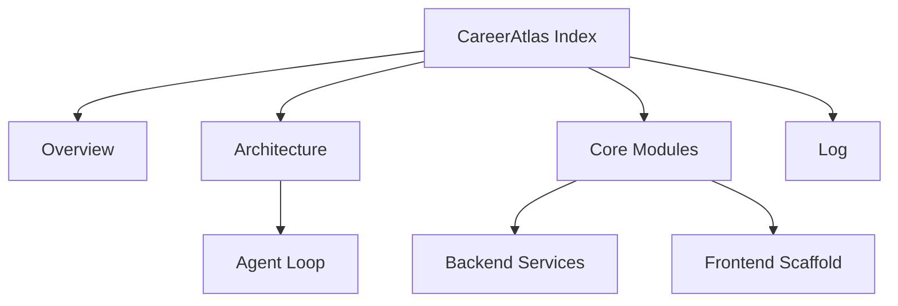

This is the entry point for the CareerAtlas wiki. Start here, then follow the linked pages to understand the current project shape, runtime flow, and update rules. The wiki is based on the active backend/frontend code and the project context docs under ai-context.[^1][^2][^3][^4]

## How To Use This Wiki

1. Read this page first.
2. Read [Overview](overview.md) for the current project summary.
3. Read [Architecture](concepts/architecture.md) for the runtime flow.
4. Read [Core Modules](entities/core-modules.md) for service-level responsibilities.
5. Read [Log](log.md) for the latest changes.

## Update Protocol

When the codebase changes, update the wiki in this order:

1. Update the most specific concept or entity page.
2. Update [Overview](overview.md) if scope, status, or key findings changed.
3. Append a new entry to [Log](log.md).
4. Update this page if the navigation or maintenance instructions change.

## Current Map

| Area | What It Covers | Primary Source Files |
| --- | --- | --- |
| Backend orchestration | Scrape, dedupe, score, alert loop | [backend/src/agent/agent.service.ts](../backend/src/agent/agent.service.ts), [backend/src/discovery/discovery.service.ts](../backend/src/discovery/discovery.service.ts), [backend/src/intelligence/intelligence.service.ts](../backend/src/intelligence/intelligence.service.ts), [backend/src/memory/memory.service.ts](../backend/src/memory/memory.service.ts), [backend/src/notifier/notifier.service.ts](../backend/src/notifier/notifier.service.ts) |
| Project context | Intent, rules, progress, changelog | [ai-context/AGENTS.md](../ai-context/AGENTS.md), [ai-context/ARCHITECTURE.md](../ai-context/ARCHITECTURE.md), [ai-context/PROGRESS.md](../ai-context/PROGRESS.md), [ai-context/RULES.md](../ai-context/RULES.md), [ai-context/CHANGELOG.md](../ai-context/CHANGELOG.md) |
| Stack and UI | Workspace stack and frontend scaffold | [techstack.md](../techstack.md), [frontend/app/page.tsx](../frontend/app/page.tsx), [frontend/app/layout.tsx](../frontend/app/layout.tsx), [frontend/app/globals.css](../frontend/app/globals.css) |

## Relationship Map

## Notes For Future Updates

- Keep titles stable so links remain useful.
- Prefer editing the most specific page rather than the index.
- Preserve citations when updating pages.

[^1]: ai-context/AGENTS.md
[^2]: ai-context/ARCHITECTURE.md
[^3]: ai-context/PROGRESS.md
[^4]: ai-context/RULES.md