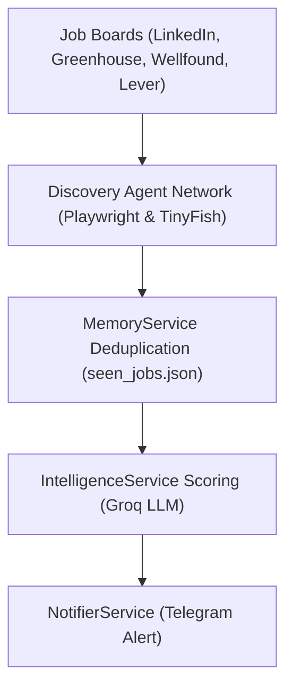

CareerAtlas, also called CareerOS in the project context, is an autonomous AI job-hunting system built around a NestJS backend that scrapes jobs, deduplicates them, scores them against a user profile, and sends Telegram alerts for strong matches.[^1][^2] The live codebase currently reflects the NestJS migration described in the context docs, while the frontend remains a starter scaffold.[^3][^4][^5] A complete end-to-end flowchart of the platform is detailed in the [System Flowchart](flowchart.md).

## Scope

The backend is the active execution layer. `AgentService` orchestrates the workflow. The `DiscoveryModule` runs 4 discovery agents in parallel: `LinkedInAgent` scrapes LinkedIn directly using Playwright browser automation with anti-bot fingerprint masking, while `AtsPortalsAgent`, `StartupBoardsAgent`, and `IndiaFocusedAgent` scrape Lever/Ashby/Workable/Greenhouse, YC/Wellfound, and Instahyre/Cutshort/Naukri via direct queries to the **TinyFish Search API** (`api.search.tinyfish.ai`). `IntelligenceService` scores candidate jobs using Groq (Llama 3.3) via LangChain.js, `MemoryService` tracks seen jobs via SHA-256 hashes, and `NotifierService` sends notifications via Telegram.[^6][^7][^8][^9][^10]

The frontend exists as a separate Next.js app, but its current page, layout, and CSS are still default create-next-app content rather than a product surface.[^11][^12][^13]

## Current Status

| Area | Status | Evidence |
| --- | --- | --- |
| Backend agent loop | Implemented | `AgentService` runs parallel scrape -> dedupe -> score -> alert.[^6] |
| Discovery Agents | Upgraded | LinkedIn uses stealth Playwright; Lever/Greenhouse/Wellfound/Instahyre/Naukri use TinyFish Search API for real-time listings. |
| Target Threshold | Upgraded | The MVP target has been increased to 5 matching jobs per query session.[^6] |
| Location Targeting & LLM Verification | Hardened | LLM Scorer extracts true physical location from snippet text to reject out-of-city/remote matches. Orchestrator applies true location prior to hashing.[^8] |
| URL Path Targeting | Hardened | `IndiaFocusedAgent` limits results to singular job details (`/job/`, `/job-listings-`) to exclude dynamic directory pages. YC/Wellfound filter out catalog URLs.[^7] |
| Model scoring | Implemented | `ChatGroq` uses `llama-3.3-70b-versatile` with zero temperature.[^8] |
| Deduplication | Implemented | `seen_jobs.json` is a flat hash store keyed by title and company.[^9] |
| Telegram alerts | Implemented | Alerting uses native `fetch` against the Telegram Bot API.[^10] |
| Frontend product UI | Not yet built | `frontend/app/page.tsx` is the default starter page.[^11] |
| Frontend source files | Scaffolding only | `page.tsx`, `layout.tsx`, and `globals.css` are still starter files.[^11][^12][^13] |
| Project documentation | Centralized in ai-context | `ai-context/` holds the current operating docs and roadmap.[^1][^2][^3][^4] |

## Key Findings

- The project is organized around one autonomous workflow rather than a manual job board browsing app.[^1][^2]
- DuckDuckGo / general search engine indexed page crawls return expired/stale job links. Transitioning to direct API calls via TinyFish Search API yields live, active jobs and speeds up searches by 10x.
- Anti-fingerprint masking (blocking WebGL/Canvas, overriding `navigator.webdriver`) is required to prevent LinkedIn checkpoints.
- `profile.json` (parsed from uploaded resume PDF) represents the target candidate profile containing skills, target role, education, and experience level.
- Shorter date query windows (e.g. 7 days) and strict LLM instructions for experience level comparison are critical to filter out stale search engine index pages and out-of-level roles.

## Runtime Overview

[^1]: ai-context/AGENTS.md
[^2]: ai-context/ARCHITECTURE.md
[^3]: ai-context/PROGRESS.md
[^4]: ai-context/RULES.md
[^5]: backend/package.json
[^6]: backend/src/agent/agent.service.ts
[^7]: backend/src/discovery/discovery.module.ts
[^8]: backend/src/intelligence/intelligence.service.ts
[^9]: backend/src/memory/memory.service.ts
[^10]: backend/src/notifier/notifier.service.ts
[^11]: frontend/app/page.tsx
[^12]: frontend/app/layout.tsx
[^13]: frontend/app/globals.css