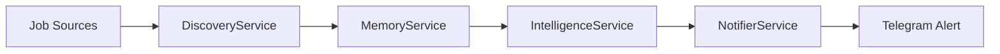

CareerAtlas, also called CareerOS in the project context, is an autonomous AI job-hunting system built around a NestJS backend that scrapes jobs, deduplicates them, scores them against a user profile, and sends Telegram alerts for strong matches.[^1][^2] The live codebase currently reflects the NestJS migration described in the context docs, while the frontend remains a starter scaffold.[^3][^4][^5]

## Scope

The backend is the active execution layer. `AgentService` orchestrates the workflow, `DiscoveryService` scrapes LinkedIn with Playwright, `IntelligenceService` scores jobs with Groq via LangChain, `MemoryService` tracks seen jobs through SHA-256 hashes, and `NotifierService` sends alerts through Telegram.[^6][^7][^8][^9][^10]

The frontend exists as a separate Next.js app, but its current page and layout are still default create-next-app content rather than a product surface.[^11][^12][^13]

## Current Status

| Area | Status | Evidence |
| --- | --- | --- |
| Backend agent loop | Implemented | `AgentService` runs scrape -> dedupe -> score -> alert.[^6] |
| Model scoring | Implemented | `ChatGroq` uses `llama-3.3-70b-versatile` with zero temperature.[^8] |
| Deduplication | Implemented | `seen_jobs.json` is a flat hash store keyed by title and company.[^9] |
| Telegram alerts | Implemented | Alerting uses native `fetch` against the Telegram Bot API.[^10] |
| Frontend product UI | Not yet built | `frontend/app/page.tsx` is the default starter page.[^11] |
| Project documentation | Centralized in ai-context | `ai-context/` holds the current operating docs and roadmap.[^1][^2][^3][^4] |

## Key Findings

- The project is organized around one autonomous workflow rather than a manual job board browsing app.[^1][^2]
- The live code already reflects the NestJS migration described in the project notes.[^1][^3][^6]
- The frontend has the modern Next.js 16 and React 19 stack, but the UI has not yet been replaced with product-specific views.[^5][^11][^12][^13]
- `profile.txt` remains the user-editable career target input for scoring decisions.[^8]

## Runtime Overview

[^1]: ai-context/AGENTS.md
[^2]: ai-context/ARCHITECTURE.md
[^3]: ai-context/PROGRESS.md
[^4]: ai-context/RULES.md
[^5]: backend/package.json
[^6]: backend/src/agent/agent.service.ts
[^7]: backend/src/discovery/discovery.service.ts
[^8]: backend/src/intelligence/intelligence.service.ts
[^9]: backend/src/memory/memory.service.ts
[^10]: backend/src/notifier/notifier.service.ts
[^11]: frontend/app/page.tsx
[^12]: frontend/app/layout.tsx
[^13]: frontend/app/globals.css