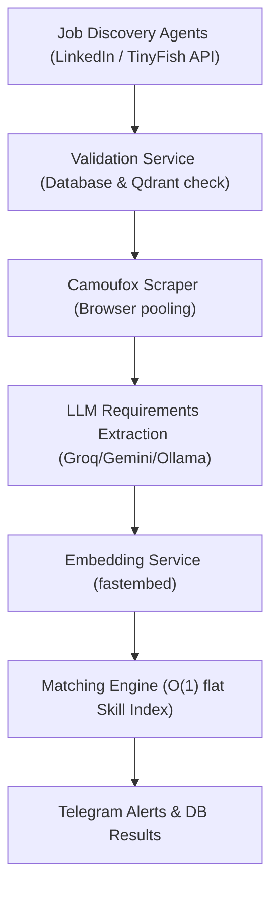

CareerAtlas is an autonomous, queue-driven AI job-hunting system built around a NestJS backend that scrapes jobs, validates status, extracts candidates' requirements, indexes embeddings in Qdrant, scores matches against user profiles, and sends Telegram alerts.

## Scope

The backend is fully asynchronous and queue-driven. The `DiscoveryModule` orchestrates parallel crawlers: `LinkedInAgent` and TinyFish API-driven agents (`AtsPortalsAgent`, `StartupBoardsAgent`, `IndiaFocusedAgent`). All jobs are verified, scraped, analyzed using LLM model chains, embedded, and scored against candidates' resumes in a scalable pipeline.

## Current Status

| Area | Status | Technical Details |
| --- | --- | --- |
| **Backend Architecture** | Distributed | decopled into 6 specialized BullMQ workers coordinated via Redis. |
| **Deduplication & Cache** | Redis-Backed | Uses Redis sets (`careeratlas:processed_jobs`) with a 24-hour expiration TTL. |
| **Validation Checks** | Advanced | Performs early Qdrant index lookups, location synonym checks, and deep 404/expiry validation. |
| **Scraping Engine** | Optimized | Employs anti-detect browser session pooling and context isolation to minimize CPU overhead. |
| **Embedding Generation** | In-Process | Powered by Qdrant `fastembed` (`BGE-Small-EN-v1.5`) running locally in Node.js. |
| **State Coordination** | Thread-Safe | Coordinates workers via Redis hash states and atomic `INCR` counter keys. |
| **Match Scoring** | Constant-Time | Uses flat `SKILL_INDEX` taxonomy matching for $O(1)$ efficiency. |
| **Notification Engine** | Telegram-Ready | Pushes alerts and custom LLM rationales to Telegram Bot API. |

## Key Findings

- **Decoupled Architecture**: Transitioning from a linear NestJS service loop to BullMQ workers allows heavy operations (like scraping and embedding) to run concurrently without blocking event loops or API endpoints.
- **In-Process Embeddings**: Running `fastembed` in-process avoids network latency and API costs while utilizing local hardware acceleration.
- **Browser Context Pooling**: Reusing a running browser process and creating fresh page contexts per scrape task provides cookie isolation while reducing CPU/RAM spikes by 10x.
- **Redis TTL Caching**: Expirations on Redis deduplication keys avoid database bloat and ensure that candidate searches remain fresh day-to-day.

## Runtime Pipeline Flow

